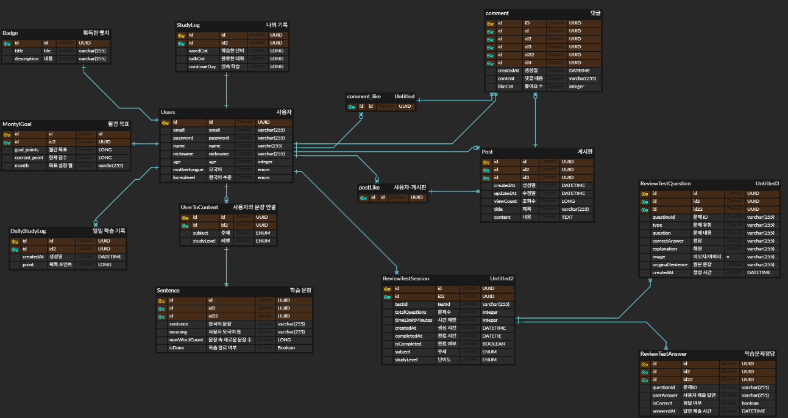
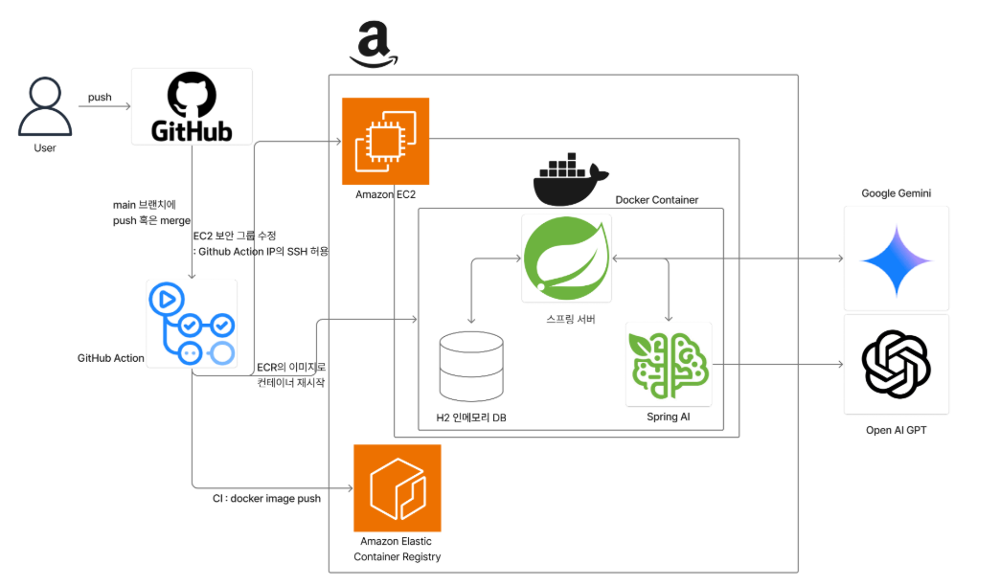

# Backend

- 이 디렉토리는 `반월`의 서버 코드입니다.
- 이 문서와 하위 문서에서는 서버 코드에 관련된 설명, 실행 방법, 사용한 AI에 대한 설명, 데이터베이스 구조, 배포 환경 등에 대해 다룹니다.

---

# 사용 기술

### 코어 기술

- 프로그래밍 언어: **Java 21**
- 프레임워크: **Spring Boot 3.5.5**
- 데이터베이스: **H2 Database** (인메모리)
- 의존성 관리: **Gradle**

### 보안 및 데이터

- 보안: **Spring Security**
- ORM: **Spring Data JPA**
- 쿼리: **Spring Data Querydsl 5.1.0**
- 인증: **JWT**

### 도구 및 유틸리티

- API 문서화: **Springdoc-openapi**
- 테스트: **JUnit 5, Mockito**
- SQL 로깅: **P6Spy**
- 클라우드: **Amazon Web Service**
- AI: **Spring-AI 1.0.1**

---

### API 사용 가이드

**API 문서**
*현재는 사용할 수 없습니다*

- 저희 팀의 API 문서는 아래의 웹페이지에서 확인하고 직접 테스트해볼 수 있습니다.
-> [반월 서버 API 문서 바로가기](http://3.36.107.16/swagger-ui/index.html#/)

---

# 시작하기

### A. 설치하기

- **Git를 통한 다운로드**

```powershell
git clone https://github.com/kdongsu5509/Moon_Light_Hackathon2025-HalfMoon.git
```

```powershell
cd Moon_Light_Hackathon2025-HalfMoon
```

- **Git이 없는 경우 → ZIP 다운로드**
  - [메인페이지](https://github.com/kdongsu5509/Moon_Light_Hackathon2025-HalfMoon)의 초록색 `Code` 버튼 클릭
  - `Download ZIP` 선택
  - ZIP 파일 압축 해체
  - 터미널을 열고 해당 폴더로 이동

### B. 공통 준비 사항

- `OpenAI` 의 `API KEY` 발급하기
  - [Open AI API KEY 발급 웹사이트 바로가기](https://platform.openai.com/account/api-keys)
- `Gemini` 의 `API KEY` 발급하기
  - [Gemini API 키 사용 설명 페이지](https://ai.google.dev/gemini-api/docs/api-key?hl=ko)
- `application-secret.yaml` 준비하기
  - **application-secret.yaml** 파일을 프로젝트 루트의 `src/main/resources` 디렉토리에 생성하세요.

        ```yaml
        spring:
          datasource:
            url: jdbc:h2:mem:testdb
            driver-class-name: org.h2.Driver
            usernickname: sa
            password:
            dbcp2: # 일정 시간마다 커넥션을 검사하여 유효하지 않은 커넥션을 제거
              test-on-borrow: true
              validation-query: SELECT 1
        
          jpa:
            hibernate:
              ddl-auto: create-drop
            show-sql: true
            defer-datasource-initialization: true
            properties:
              hibernate:
                dialect: org.hibernate.dialect.H2Dialect
                format_sql: true
                database-platform: org.hibernate.dialect.H2Dialect
          sql:
            init:
              mode: always
        
          servlet:
            multipart:
              max-file-size: 30MB #업로드할 수 있는 개별 파일의 최대 크기. 기본 1MB
              max-request-size: 30MB
          ai:
            openai:
              api-key: {YOUR-OPENAI-API-KEY}
        
        jwt:
          secret: {YOUR-JWT-SECRET}
          access-expiration-minutes: 1440 # 1일
          refresh-expiration-days: 14
          refresh-cookie-name: refresh_token
          access-header-name: Authorization
        
        google:
          api:
            key: {YOUR-GOOGLE-API-KEY}
        
        white-list:
          paths:
            - "/swagger-ui.html"            # Swagger UI 관련 HTML 페이지
            - "/swagger-ui/**"              # Swagger UI 관련 정적 리소스
            - "/v3/api-docs/**"             # Swagger UI 관련 API 문서
            - "/swagger-resources/**"       # Swagger UI 관련 리소스
            - "/webjars/**"                 # Swagger UI 관련 웹 자원
            - "/api/auth/reissue"           #토큰 재발급
            - "/api/signup"                 #회원가입
            - "/api/signup/**"              #회원가입 - 기타
            - "/api/login"                  #로그인
            - "/api/check/**"               # 중복 체크
        ```

### C. 실행하기

- **Docker로 실행하기**

```bash
docker build -t banwol-backend:latest . # Docker 이미지 빌드
docker run -d -p 8080:8080 --name banwol-backend banwol-backend:latest # Docker 컨테이너 실행
docker logs -f banwol-backend # 로그을 통해 정상 실행 확인
```

- **로컬 환경에서 실행하기** : [사용자 컴퓨터에서 실행하기](https://github.com/kdongsu5509/Moon_Light_Hackathon2025-HalfMoon/blob/main/Backend/docs/local-run.md)

# 사용한 AI 모델 및 구현 방식

> 저희 팀은 `Spring AI` 와 `Rest API`를 이용하여 다양한 상용 AI를 사용했습니다. `Spring AI` 가 궁금하신 분은 [Spring AI Reference](https://docs.spring.io/spring-ai/reference/index.html) 에 방문하시면 상세한 내용을 구경하실 수 있습니다.
>

## Chat Model

### 세부 사용 모델과 해당 모델을 사용하는 기능

**사용한 모델**

- Open AI, gpt-4o-mini

**관련 기능**

- 주제와 난이도에 맞춰 학습 자료 생성
- 주제별 대화 연습

**관련 설정**

- [Spring AI Reference/Chat Model/Open AI](https://docs.spring.io/spring-ai/reference/api/chat/openai-chat.html) 참고하여 진행.
- 해당 라이브러리의 `Auto Configutation` 을 수정하지 않고 사용하여도 충분한 기능들이라 판단되어 아래 설정만을 추가한 채로 자동화된 설정을 사용하였습니다.
  - 기본 제공 모델 : `gpt-4o-mini`
  - 그 외 추가적인 기존 설정들은 앞서 언급한 웹페이지에 방문하시면 확인하실 수 있습니다.

```yaml
spring:
 ai:
  openai:
   api-key: {YOUR_OPENAI_API_KEY}
```

### Structured Output : 주제와 난이도에 맞춰 학습 자료 생성 시

**사용 이유**

- 해당 프로젝트의 데이터베이스는 `RDB` 을 사용하고 있습니다.
- 사용자가 학습 중 중단을 하여도, 현재 진행 상태를 확인할 수 있게 하기 위해서는 생성된 학습 자료(문장)이 데이터베이스에 저장되도록 했어야 했습니다.
- 생성 후 저장을 자동으로 하면서도, 사용자가 원하면 언제든 꺼내볼 수 있도록 하기 위해`Structured Output` 을 도입했습니다.

**사용방법**

- 사용 방법은 [Spring AI-Structured Output](https://docs.spring.io/spring-ai/reference/api/structured-output-converter.html) 을 참고하세요.

**해당 프로젝트 코드에서 사용**

- 구조 지정

```java
public record AIStudySentence(
    String sentence, String meaning, Long newWordCount) {
}

public record AISubjectStudyContentsResponse(
    List<AIStudySentence> contents) {
}
```

- 답변 생성 시 사용

```java
private final OpenAiChatModel chatModel;
PromptMessage promptMessage = new PromptMessage(); // 프롬프트 메시지를 관리하는 객체

private void generateSubjectStudyContentsWithOpenAi(SubjectStudyContenstRequestDto req,
                                                        User user) {
       //{...생략...}
        AISubjectStudyContentsResponse entity = ChatClient.create(chatModel).prompt()
                .user(u -> u.text(
                        promptMessage.subjectStudyContentsCreatingPrompt
                ).params(params))
                .call()
                .entity(AISubjectStudyContentsResponse.class);

        //{...생략...}
    }
```

### Chat Memory : 해당 모델 사용 시 대화 맥락을 유지한 방법

**사용 이유**

- 주제별 대화를 할 때, AI는 사용자와의 이전 내용을 전혀 기억하지 못하는 문제가 있습니다.
- 해결 방법으로는 `Spring AI` 가 이전에 사용했던, 매번 대화 때마다 직접 이전 사용자의 대화와 AI 모델의 답변을 추가해주는 방식이 존재합니다.
- `Chat Memeory` 사용 시 직접 대화 내용을 주입하고, 저장하지 않아도 되어서 해당 기능을 사용했습니다.

**사용 방법**

- JDBC, Neo4J, Cassandra를 이용하는 방법은 [spring-ai/reference/api/chat-memory](https://docs.spring.io/spring-ai/reference/api/chat-memory.html) 을 참고하세요.
- 해당 프로젝트에서는 `In-Memory-Repository` 를 사용했습니다

**해당 프로젝트에서 사용된 코드**

- 설정
  - `Spring AI auto-configures` 를 통해 별도의 설정 없이 사용 가능
- 대화 시작 시 대화 구분자를 제공 및 해주어야 함.

    ```java
    String conversationId = "001";
    ```

- 이후 대화마다 `대화 구분자` 와 `ChatMememory` 를 이용하여 대화 맥락 유지

    ```java
    chatMemory.add(conversationId, userMessage);
    ChatResponse response = chatModel.call(new Prompt(chatMemory.get(conversationId)));
    chatMemory.add(conversationId, response.getResult().getOutput());
    ```

## TTS

### 세부 사용 모델과 해당 프로젝트에서 이를 이용한 기능

**사용한 모델**

- Open AI, tts-1

**관련 기능**

- 사용자가 학습하는 문장의 한국어 발음 듣기 시 사용

**관련 설정**

- [Spring AI Reference/Audio/Speech/OpenAiSpeech](https://docs.spring.io/spring-ai/reference/api/audio/speech/openai-speech.html) 참고하여 진행.
- 해당 라이브러리의 `Auto Configutation` 을 수정하지 않고 사용하여도 충분한 기능들이라 판단되어 아래 설정만을 추가한 채로 자동화된 설정을 사용하였습니다.
  - 기본 제공 모델 : `tts-1`
  - 그 외 추가적인 기존 설정들은 앞서 언급한 웹페이지에 방문하시면 확인하실 수 있습니다.

### 해당 프로젝트에서 사용

```java
public byte[] convertTextToSpeech(String text) {
        OpenAiAudioSpeechOptions speechOptions = OpenAiAudioSpeechOptions.builder()
                .model("tts-1")
                .voice(Voice.ALLOY)
                .responseFormat(OpenAiAudioApi.SpeechRequest.AudioResponseFormat.MP3)
                .speed(1.0f)
                .build();

        SpeechPrompt speechPrompt = new SpeechPrompt(text, speechOptions);
        SpeechResponse response = openAiAudioSpeechModel.call(speechPrompt);

        OpenAiAudioSpeechResponseMetadata metadata = response.getMetadata();
        return response.getResult().getOutput();
    }
```

## STT

### 세부 사용 모델과 해당 프로젝트에서 이를 이용한 기능

**사용한 모델**

- Open AI, whisper-1

**관련 기능**

- 주제별 대화 시, 사용자가 음성을 통해 대화할 때 사용.

**관련 설정**

- [spring-ai/reference/api/audio/transcriptions/openai-transcriptions](https://docs.spring.io/spring-ai/reference/api/audio/transcriptions/openai-transcriptions.html) 참고하여 진행
- 해당 라이브러리의 `Auto Configutation` 을 수정하지 않고 사용하여도 충분한 기능들이라 판단되어 아래 설정만을 추가한 채로 자동화된 설정을 사용하였습니다.
  - 기본 제공 모델 : `whisper-1`
  - 그 외 추가적인 기존 설정들은 앞서 언급한 웹페이지에 방문하시면 확인하실 수 있습니다.

### 해당 프로젝트에서 사용

```java
private final OpenAiAudioTranscriptionModel openAiAudioTranscriptionModel;

    public String convertAudioToText(byte[] audioData) {
        Resource audioResource = new ByteArrayResource(audioData);

        OpenAiAudioTranscriptionOptions transcriptionOptions = OpenAiAudioTranscriptionOptions.builder()
                .responseFormat(TranscriptResponseFormat.TEXT)
                .temperature(0f)
                .language("ko")
                .build();

        AudioTranscriptionPrompt transcriptionPrompt = new AudioTranscriptionPrompt(audioResource,
                transcriptionOptions);

        AudioTranscriptionResponse response = openAiAudioTranscriptionModel.call(transcriptionPrompt);

        return response.getResult().getOutput();
    }
```

## REST API를 통한 이용

### 세부 사용 모델과 해당 프로젝트에서 이를 이용한 기능

**사용한 모델**

- Google, Gemini-2.5-Flash

**관련 기능**

- 사용자가 문장을 학습할 때, 한국어 발음의 정확도를 10점 만점으로 평가하기 위해 제공.

**관련 설정**

- [gemini-api/audio docs](https://ai.google.dev/gemini-api/docs/audio?hl=ko) 를 참고하여 진행

**사용 이유**

- Spring AI를 통해 사용할 수 있는 Audio 모델에서는 발음 정확도를 평가하는 것을 지원하는 모델이 없어 부득이하게 Rest API를 통해 사용

### 해당 프로젝트에서 사용

- 앞서 언급한 docs에서의 Rest API를 스프링과 통합하여 사용

**Step1. 음성 파일 업로드 URL 생성**

```java
private String getUploadUrl(String contentsLength, String mimeType) throws IOException {
        HttpURLConnection connection = getUploadUrlConnection(contentsLength, mimeType);

        String json = "{\"file\":{\"display_name\":\"AUDIO\"}}";
        sendRequestToGoogle(connection, json);

        return extractUploadUrlFromHeader(connection);
    }
    
private HttpURLConnection getUploadUrlConnection(String contentsLength, String mimeType) throws IOException {
        HttpURLConnection connection = (HttpURLConnection) URI.create(UPLOAD_URL_REQUEST_URL).toURL().openConnection();
        connection.setRequestProperty("x-goog-api-key", GOOGLE_API_KEY);
        connection.setRequestMethod("POST");
        connection.setRequestProperty("X-Goog-Upload-Protocol", "resumable");
        connection.setRequestProperty("X-Goog-Upload-Command", "start");
        connection.setRequestProperty("X-Goog-Upload-Header-Content-Length", contentsLength);
        connection.setRequestProperty("X-Goog-Upload-Header-Content-Type", mimeType);
        connection.setRequestProperty("Content-Type", "application/json");
        connection.setDoOutput(true);
        return connection;
    }
```

**Step2. 음성 파일 업로드**

```java
private String uploadFileAndReturnFileUrl(String fileUploadPathUrl, String numBytes, MultipartFile audio)
            throws IOException {
        HttpURLConnection uploadConn = getFileUploadHttpURLConnection(fileUploadPathUrl, numBytes);

        try (OutputStream os = uploadConn.getOutputStream(); InputStream is = audio.getInputStream()) {
            byte[] buffer = new byte[8192];
            int bytesRead;
            while ((bytesRead = is.read(buffer)) != -1) {
                os.write(buffer, 0, bytesRead);
            }
        } catch (IOException e) {
            log.error("Error uploading file: {}", e.getMessage());
            throw new RuntimeException("File upload failed", e);
        }

        JsonNode fileJson = new ObjectMapper().readTree(uploadConn.getInputStream());
        return fileJson.path("file").path("uri").asText();
    }
    
    
private static HttpURLConnection getFileUploadHttpURLConnection(String fileUploadPathUrl, String numBytes)
            throws IOException {
        HttpURLConnection connection = (HttpURLConnection) URI.create(fileUploadPathUrl).toURL().openConnection();
        connection.setRequestMethod("POST");
        connection.setRequestProperty("Content-Length", numBytes);
        connection.setRequestProperty("X-Goog-Upload-Offset", "0");
        connection.setRequestProperty("X-Goog-Upload-Command", "upload, finalize");
        connection.setDoOutput(true);
        return connection;
    }
```

**Step3. 해당 파일을 통해 Gemini에게 분석 요청**

```java
private int doGeminiAudioAnalyze(String prompt) throws IOException {
        HttpURLConnection contentConn = getAnalyzeHttpURLConnection();
        sendRequestToGoogle(contentConn, prompt);

        ObjectMapper mapper = new ObjectMapper();
        JsonNode root = new ObjectMapper().readTree(contentConn.getInputStream());

        String text = root.path("candidates")
                .get(0)
                .path("content")
                .path("parts")
                .get(0)
                .path("text")
                .asText();

        JsonNode innerJson = mapper.readTree(text);
        return innerJson.path("score").asInt();
    }
```

**전체 코드**

```java

@Slf4j
@Service
@RequiredArgsConstructor
public class PronunciationService {

    @Value("${google.api.key}")
    private String GOOGLE_API_KEY;
    private final static String PROMPT_FILE = "prompt.txt";
    private final static String UPLOAD_URL_REQUEST_URL = "https://generativelanguage.googleapis.com/upload/v1beta/files";
    private final static String ANALYZE_URL = "https://generativelanguage.googleapis.com/v1beta/models/gemini-2.5-flash:generateContent";

    public Integer geminiAnalyze(MultipartFile audio) throws IOException {

        final String rawPrompt = getPronunciationEvaluatePrompt();

        String mimeType = audio.getContentType() != null ? audio.getContentType() : null;
        String numBytes = String.valueOf(audio.getSize());

        String uploadUrl = getUploadUrl(numBytes, audio.getContentType());
        String fileUri = uploadFileAndReturnFileUrl(uploadUrl, numBytes, audio);

        log.info("GeminiAnalyze file: {}", fileUri);
        String prompt = String.format(rawPrompt, mimeType, fileUri); // 프롬프트에 오디오 파일 URL 포함

        log.info("GeminiAnalyze prompt: {}", prompt);
        int score = doGeminiAudioAnalyze(prompt);
        System.out.println("Score: " + score);
        return score;
    }

    private int doGeminiAudioAnalyze(String prompt) throws IOException {
        HttpURLConnection contentConn = getAnalyzeHttpURLConnection();
        sendRequestToGoogle(contentConn, prompt);

        ObjectMapper mapper = new ObjectMapper();
        JsonNode root = new ObjectMapper().readTree(contentConn.getInputStream());

        String text = root.path("candidates")
                .get(0)
                .path("content")
                .path("parts")
                .get(0)
                .path("text")
                .asText();

        JsonNode innerJson = mapper.readTree(text);
        return innerJson.path("score").asInt();
    }

    private HttpURLConnection getAnalyzeHttpURLConnection() throws IOException {
        HttpURLConnection contentConn = (HttpURLConnection) URI.create(ANALYZE_URL).toURL().openConnection();
        contentConn.setRequestMethod("POST");
        contentConn.setRequestProperty("x-goog-api-key", GOOGLE_API_KEY);
        contentConn.setRequestProperty("Content-Type", "application/json");
        contentConn.setDoOutput(true);
        return contentConn;
    }

    private String getUploadUrl(String contentsLength, String mimeType) throws IOException {
        HttpURLConnection connection = getUploadUrlConnection(contentsLength, mimeType);

        String json = "{\"file\":{\"display_name\":\"AUDIO\"}}";
        sendRequestToGoogle(connection, json);

        return extractUploadUrlFromHeader(connection);
    }

    private static String extractUploadUrlFromHeader(HttpURLConnection connection) {
        return connection.getHeaderFields().entrySet().stream()
                .filter(e -> "x-goog-upload-url".equalsIgnoreCase(e.getKey()))
                .map(Map.Entry::getValue)
                .flatMap(List::stream)
                .findFirst()
                .orElseThrow(() -> new RuntimeException("Upload URL not found"));
    }

    private static void sendRequestToGoogle(HttpURLConnection startConn, String message) throws IOException {
        try (OutputStream os = startConn.getOutputStream()) {
            os.write(message.getBytes());
        }
    }

    private String uploadFileAndReturnFileUrl(String fileUploadPathUrl, String numBytes, MultipartFile audio)
            throws IOException {
        HttpURLConnection uploadConn = getFileUploadHttpURLConnection(fileUploadPathUrl, numBytes);

        try (OutputStream os = uploadConn.getOutputStream(); InputStream is = audio.getInputStream()) {
            byte[] buffer = new byte[8192];
            int bytesRead;
            while ((bytesRead = is.read(buffer)) != -1) {
                os.write(buffer, 0, bytesRead);
            }
        } catch (IOException e) {
            log.error("Error uploading file: {}", e.getMessage());
            throw new RuntimeException("File upload failed", e);
        }

        JsonNode fileJson = new ObjectMapper().readTree(uploadConn.getInputStream());
        return fileJson.path("file").path("uri").asText();
    }

    private String getPronunciationEvaluatePrompt() {
        try {
            StringBuilder sb = new StringBuilder();
            List<String> lines = getContentsFromFile();
            for (String line : lines) {
                sb.append(line);
            }
            return sb.toString();
        } catch (IOException e) {
            throw new RuntimeException("Error reading prompt txt file", e);
        }
    }

    private static List<String> getContentsFromFile() throws IOException {
        ClassPathResource resource = new ClassPathResource(PROMPT_FILE);
        Path path = Paths.get(resource.getURI());

        return Files.readAllLines(path);
    }

    private HttpURLConnection getUploadUrlConnection(String contentsLength, String mimeType) throws IOException {
        HttpURLConnection connection = (HttpURLConnection) URI.create(UPLOAD_URL_REQUEST_URL).toURL().openConnection();
        connection.setRequestProperty("x-goog-api-key", GOOGLE_API_KEY);
        connection.setRequestMethod("POST");
        connection.setRequestProperty("X-Goog-Upload-Protocol", "resumable");
        connection.setRequestProperty("X-Goog-Upload-Command", "start");
        connection.setRequestProperty("X-Goog-Upload-Header-Content-Length", contentsLength);
        connection.setRequestProperty("X-Goog-Upload-Header-Content-Type", mimeType);
        connection.setRequestProperty("Content-Type", "application/json");
        connection.setDoOutput(true);
        return connection;
    }

    private static HttpURLConnection getFileUploadHttpURLConnection(String fileUploadPathUrl, String numBytes)
            throws IOException {
        HttpURLConnection connection = (HttpURLConnection) URI.create(fileUploadPathUrl).toURL().openConnection();
        connection.setRequestMethod("POST");
        connection.setRequestProperty("Content-Length", numBytes);
        connection.setRequestProperty("X-Goog-Upload-Offset", "0");
        connection.setRequestProperty("X-Goog-Upload-Command", "upload, finalize");
        connection.setDoOutput(true);
        return connection;
    }
}
```

# 데이터베이스 구조

### ERD 참고



# AWS 배포 환경 설정 및 구성

### 구성



## Github Action를 통한 CI/CD

- 해당 서버 코드는 `Github Action` 를 통해 `CI/CD` 가 적용되어 있습니다.

**Github Action에서 설정**

- 동작 조건 : 아래 2 조건이 모두 충족되어야 함.
  - `main` 브랜치에 `push` 가 발생
  - `/Backend` 하위 브랜치에서 변경이 존재
- 동작 환경
  - `/Backend` 폴더 하위에서 동작.
- AWS 관련 보안 설정
  - 현재 사용 중인 `EC2` 는 SSH 포토의 접근 IP를 제한하고 있음.
  - `CI/CD` 을 할 때에는 `Github Action`을 수행하는 환경의 `IP` 를 파악 후 `CD` 작업 전 임시로 해당 `IP` 를 허용하여 작업을 수행.
  - 작업이 끝나면 임시로 허용한 `IP`를 다시 허용하는 `IP` 목록에서 제거.

**CI/CD를 위해 사용 중인 설정 파일**

```yaml
# .github/workflows/ci-cd.yml

name: Spring CI-CD with AWS

on:
  push:
    branches: [ "main" ]
    paths:
      - 'Backend/**' 
env:
  AWS_REGION: ap-northeast-2
  ECR_REPOSITORY: hackathon/halfmoon
  CONTAINER_NAME: spring-app
  PROJECT_PATH: ./Backend

jobs:
  # -------------------- CI (Build & Push to ECR) --------------------
  ci:
    name: Continuous Integration
    runs-on: ubuntu-latest
    
    outputs:
      image_uri: ${{ steps.build-image.outputs.image }}

    steps:
      - name: Checkout
        uses: actions/checkout@v4

      - name: Set up JDK 21
        uses: actions/setup-java@v4
        with:
          java-version: "21"
          distribution: "temurin"

      - name: Grant execute permission for gradlew
        run: chmod +x ${{ env.PROJECT_PATH }}/gradlew

      - name: Add application-secret.yaml
        env:
          SPRING_SECRET_YAML: ${{ secrets.SPRING_SECRET_YAML }}
        run: |
          echo "$SPRING_SECRET_YAML" > ${{ env.PROJECT_PATH }}/src/main/resources/application-secret.yaml # ⭐ 경로 변수 사용

      - name: Build with Gradle (do tests internally)
        run: ./gradlew clean build
        working-directory: ${{ env.PROJECT_PATH }}

      - name: Configure AWS credentials
        uses: aws-actions/configure-aws-credentials@v4
        with:
          aws-access-key-id: ${{ secrets.AWS_ACCESS_KEY_ID }}
          aws-secret-access-key: ${{ secrets.AWS_SECRET_ACCESS_KEY }}
          aws-region: ${{ env.AWS_REGION }}

      - name: Login to Amazon ECR
        id: login-ecr
        uses: aws-actions/amazon-ecr-login@v2

      - name: Build, tag, and push image to Amazon ECR
        id: build-image
        env:
          ECR_REGISTRY: ${{ steps.login-ecr.outputs.registry }}
          IMAGE_TAG: ${{ github.sha }}
        run: |
          set -euo pipefail
          docker build -t "$ECR_REGISTRY/$ECR_REPOSITORY:$IMAGE_TAG" -f ${{ env.PROJECT_PATH }}/Dockerfile ${{ env.PROJECT_PATH }} # ⭐ Dockerfile 경로와 빌드 컨텍스트 지정
          docker push "$ECR_REGISTRY/$ECR_REPOSITORY:$IMAGE_TAG"
          echo "image=$ECR_REGISTRY/$ECR_REPOSITORY:$IMAGE_TAG" >> "$GITHUB_OUTPUT"

  # -------------------- CD (Deploy on EC2) --------------------
  cd:
    name: Continuous Deployment
    needs: ci
    runs-on: ubuntu-latest
    
    steps:
      # CD 단계는 변경 사항 없음
      - name: Get GitHub Action VM IP
        id: ip
        uses: haythem/public-ip@v1.3
      - name: Configure AWS credentials
        uses: aws-actions/configure-aws-credentials@v4
        with:
          aws-access-key-id: ${{ secrets.AWS_ACCESS_KEY_ID }}
          aws-secret-access-key: ${{ secrets.AWS_SECRET_ACCESS_KEY }}
          aws-region: ${{ env.AWS_REGION }}
      - name: Add GitHub Action VM IP to EC2 security group (SSH)
        run: |
          aws ec2 authorize-security-group-ingress \
            --group-id ${{ secrets.EC2_SECURITY_GROUP_ID }} \
            --protocol tcp \
            --port 22 \
            --cidr ${{ steps.ip.outputs.ipv4 }}/32
      - name: Deploy to EC2 via SSH
        uses: appleboy/ssh-action@v1.0.3
        with:
          host: ${{ secrets.EC2_HOST }}
          username: ${{ secrets.EC2_USERNAME }}
          key: ${{ secrets.EC2_SSH_KEY }}
          script: |
            set -euo pipefail
            IMAGE_URI='${{ needs.ci.outputs.image_uri }}'
            if [ -z "$IMAGE_URI" ]; then
              echo "ERROR: IMAGE_URI is empty. Check CI job outputs." >&2
              exit 1
            fi
            ECR_REGISTRY_URL="$(echo "$IMAGE_URI" | cut -d/ -f1)"
            if [ -z "$ECR_REGISTRY_URL" ]; then
              echo "ERROR: Failed to parse ECR registry from IMAGE_URI: $IMAGE_URI" >&2
              exit 1
            fi
            command -v docker >/dev/null 2>&1 || { echo "docker not found on EC2"; exit 1; }
            command -v aws >/dev/null 2>&1 || { echo "aws cli not found on EC2"; exit 1; }
            aws ecr get-login-password --region '${{ env.AWS_REGION }}' \
              | docker login --username AWS --password-stdin "$ECR_REGISTRY_URL"
            docker pull "$IMAGE_URI"
            docker stop '${{ env.CONTAINER_NAME }}' || true
            docker rm   '${{ env.CONTAINER_NAME }}' || true
            docker run -d -p 80:8080 --name '${{ env.CONTAINER_NAME }}' "$IMAGE_URI"
      - name: Remove GitHub Action VM IP from EC2 security group
        if: always()
        run: |
          aws ec2 revoke-security-group-ingress \
            --group-id ${{ secrets.EC2_SECURITY_GROUP_ID }} \
            --protocol tcp \
            --port 22 \
            --cidr ${{ steps.ip.outputs.ipv4 }}/32
```
